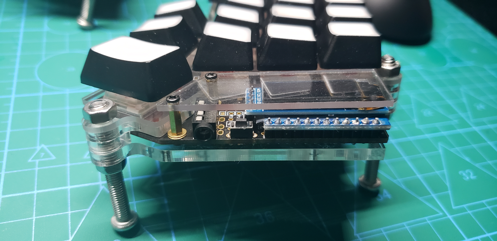
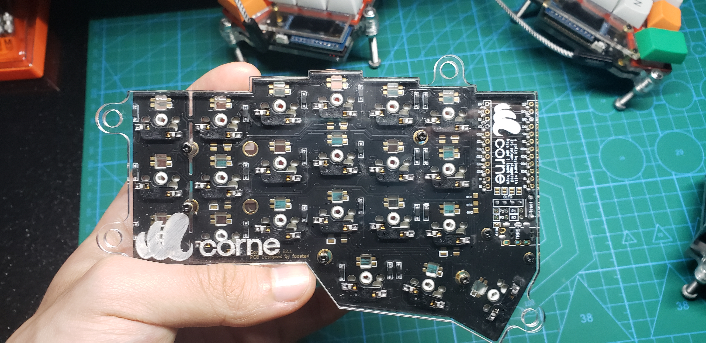
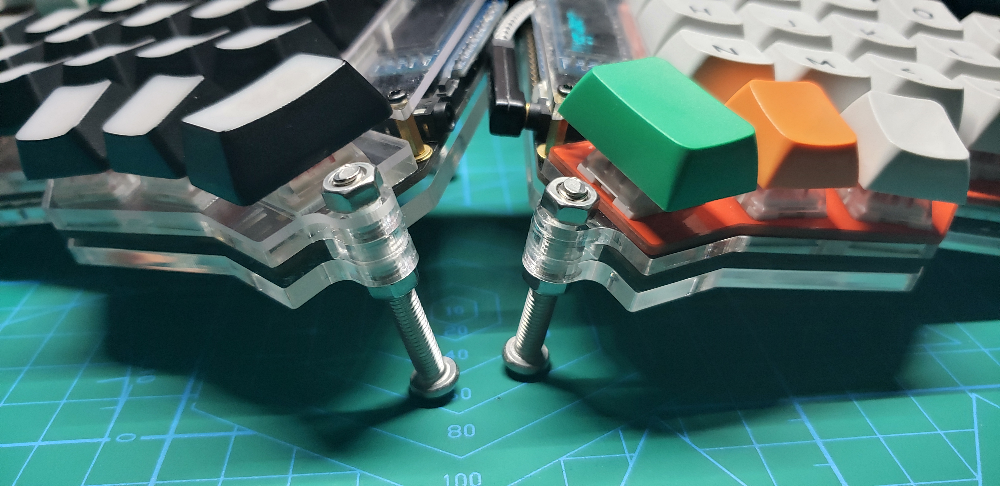
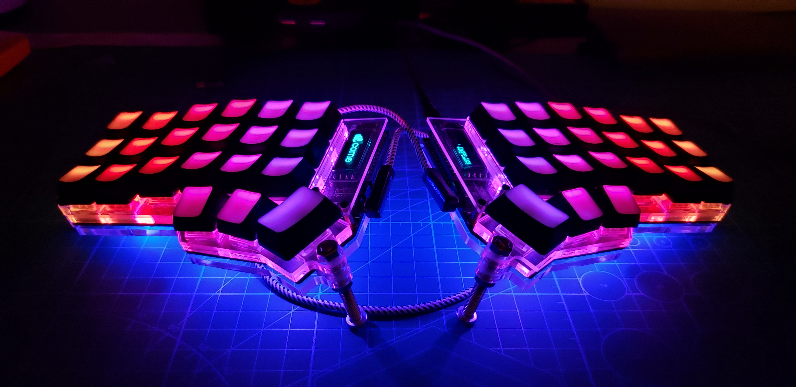
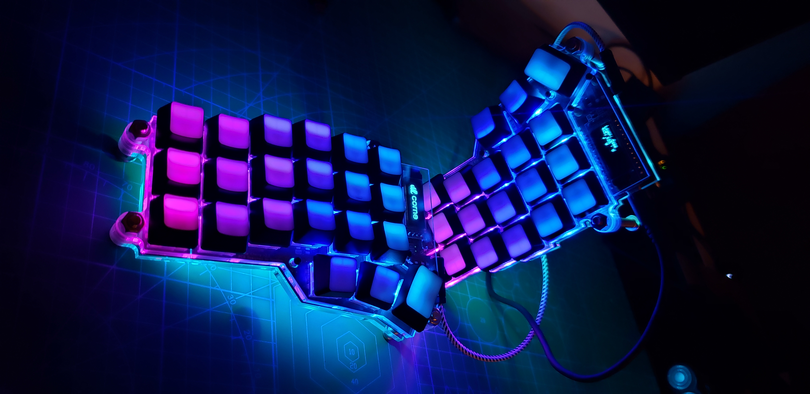

<style>
table {
border-collapse: collapse;
border-spacing: 0;
box-sizing: border-box;
}
table,th,td {
border: 1px solid grey;
line-height: 1.5;
}
td {
padding: 6px 13px;
}
</style>

&emsp;&emsp;一个月前我做了第一把客制键盘ergodox。毕竟是第一次做键盘，整个过程还是挺曲折的，第一次用电烙铁各种不熟练，好在这把键盘应该是教程最多最详细的了，一点点地啃文档和视频最后还是做完了。总共花费不到四百吧，用的最普通的pcb 外壳和键帽。唯一优点就是便宜，毕竟动辄两千的ergodox-ez不是普通人买得起的。

&emsp;&emsp;当然ergodox还不能算是退烧键盘，实际使用过程中大拇指区那几个小键基本用不到，而且体积也偏大，出街是不用想了。也是逛github时无意间找到了一把分体式人体工程键盘[Corne](https://github.com/foostan/crkbd)，第一次看到就很惊艳，结合了planck和ergodox的优点，而且大拇指区的按键位置很合理。当然配列这个因人而异，[mechanical-keyboard](https://github.com/help-14/mechanical-keyboard)里涵盖了目前绝大部分的开源机械键盘，找一个自己喜欢的配列做就行了，里面还包含了一些从零开始飞线和设计pcb、外壳的教程，非常适合新手入坑客制化。下面简单介绍下Corne的组装流程。

## 零件清单

| 名称 | 数量 | 备注 |
| :------: | :------:     | :------: |
| pcb | 2 |  |
| Pro Micro | 2 | Pro Micro会送排针 |
| 四针OLED显示屏 | 2 |   |
| SK6812mini | 54 | 轴灯×42，底灯×12 |
| 二极管 | 42 | 贴片式，比如1N4148 SOD123 |
| 凯华热插拔底座 | 42 |   |
| 耳机插座3.5MM | 2 | PJ-313D可用 |
| 机械键盘轴体开关 | 42 |   |
| 轻触开关 | 2 | 3×6×5mm可用 |
| 定位板、夹层、底板 | 2 |   |
| m2螺丝 | 24 | 6mm左右 |
| m2铜柱 | 14 | 各种长度的铜柱多备点，个人用的9mm和4mm的铜柱 |
| m5螺丝 | 8 | 15-50mm |
| m5螺母 | 16 |  |
| 3.5mm音频线 | 1 | TRS、TRRS均可 |

&emsp;
<div></div>

&emsp;&emsp;所有零件除了芯片全部都是国产的，不算键帽外壳全部用亚克力一把的成本也就不到三百吧。这里亚克力板我一共用了三层，分别是1.5mm的定位板(补充：后来觉得1.5mm的亚克力太脆了就换成pc材质了)，3mm的pcb和定位板间的夹层，4mm的底板，再加上pcb板一共四层，手感比较扎实适合线性轴。轴体我上的凯华box红，批发八毛一个，相比cherry和佳达隆良心多了。

## 焊接组装


简单贴两张图吧，官方doc里介绍的已经很详细了，可参考我的[完整组装视频](www.chie4.com)。谈几点要注意的：

   * 官方doc里Pro Micro是热插拔的，我感觉没必要就用Pro Micro自带的排针直接焊在pcb上了。正好也省的额外买排针排母。
   * 热插拔底座贴在pcb上直接上锡就行了，我视频里有焊盘预上锡，其实没必要的。不过焊二极管时还是最好要在其中一边的焊盘上预上锡。
   * 焊led灯时温度不要过高，烙铁接触led灯的不宜过长，不然很容易烧毁。当然温度低的弊端就是不容易上锡，再加上我电烙铁用的不太熟练导致最后焊的很难看，反正平时看不到也就无所谓了。(20190911补充：买个好点的焊台和熔点低的焊锡丝就不用担心led烧毁了)
   * 焊灯时要记得焊几个灯就测试一下，默认固件通上电全部灯都是红色的，虚焊会出现不亮或者变成其他颜色。SK6812mini四个引脚分别是电源、接地、数据输入、数据输出，如果出现不亮的情况打开Kicad参照电路图就很容易确定是哪些引脚虚焊了。

组装时要注意两层亚克力板间上m5螺丝的位置要塞一块填充片，厚度是和用的铜柱高度一样的，组装完成的示意图：





## 刷固件

&emsp;&emsp;一般固件在焊好板子前就提前刷好了，这样方便测试led和显示屏是否正常，减少返工的可能。不得不吐槽，Pro Micro的bootloader（Caterina）应该是我用过的bootloader里最难用，唯一优点可能就是便宜吧。当然如果实在不喜欢Caterina也可以把bootloader换成dfu或者qmk-dfu的，有能力的可以尝试下。[replace\_pro\_micro\_bootloader\_with\_qmk\_dfu](https://www.reddit.com/r/olkb/comments/8sxgzb/replace_pro_micro_bootloader_with_qmk_dfu/)

&emsp;&emsp;固件毫无疑问使用了目前最强开源键盘固件qmk，配置好环境后(参照[https://docs.qmk.fm/#/newbs\_getting\_started](https://docs.qmk.fm/#/newbs_getting_started))一行命令就完成了编译刷固件等所有操作。(windows下环境配置因国内网络环境问题需要更换源比较麻烦，linux下环境配置相对简便很多)
``` bash
sudo make crkbd:default:avrdude
```
&emsp;&emsp;当然也可以先编译hex，后刷固件
``` bash
make crkbd:default
sudo avrdude -p atmega32u4 -P /dev/ttyACM0 -c avr109 -U flash:w:crkdb_rev1_default.hex
```

&emsp;&emsp;直接刷会显示`Detecting USB port, reset your controller now...`，这时轻触两下reset开关，没有开关的话就用镊子短接两次RST和GND一般就成功了。

&emsp;&emsp;实际刷固件的过程中也是遇到了非常多的问题，各种不稳定，而且每次都会报各种不同的错误，一上午的时间查了各种资料只成功了两三次，这些问题在我之前用Halfkay和dfu时从来没遇到过。后来无意间把线从机箱前置usb2.0接口换成后置usb3.0接口就稳定了，所以如果你也遇到相同问题换台电脑或者换个接口试试吧（也不一定，比如我的笔记本不管哪个接口都不行...）

## 固件配置

&emsp;&emsp;QMK功能实在太多啦。。想了解更多QMK功能还是参考[官方文档](https://docs.qmk.fm/#/)，列几个常见问题。

### 键位布局

&emsp;&emsp;很多人觉得键位这么少的键盘根本没法用，其实只要花时间把qmk官方文档大概看一下就知道现在开源键盘有多强大了。40键盘适应后完全可以应对编程和日常工作。40配列能尽可能减少打字过程中手的移动，再加上分裂空格的存在，甚至比我之前用60键盘的效率还高，附上我目前打字使用的配列([keymap](https://github.com/chie4hao/qmk_firmware/blob/master/keyboards/crkbd/keymaps/chie4/keymap.c))。 

### 切层逻辑

&emsp;&emsp;平常使用键盘用的最多的估计就是Fn切层键了，tmk中关于切层逻辑的设置比较少，TAPPING\_TERM如果设置不当高速打字下还是会出很多问题，想要实现更复杂人性化的切层逻辑就只能修改源代码了。qmk在tmk基础上新增了几个选项，个人最常用的就是   `PERMISSIVE-HOLD` `IGNORE-MOD-TAP-INTERRUPT` `TAPPING-FORCE-HOLD` 这三个(参考[tap-hold-configuration-options](https://docs.qmk.fm/#/feature_advanced_keycodes?id=tap-hold-configuration-options))。设置得当可以解决SpaceFn高速打字时的痛点。注意TAPPING\_FORCE\_HOLD会和切层功能`TT()`冲突，不过这个切层功能很少用就是了。

### 减少固件体积
&emsp;&emsp;Corne默认固件编译完就达到了28000+bytes的体积，想加入一些常用功能如鼠标键或蜂鸣器之类的就很难了，减少固件体积的方法：

* 在`rules.mk`文件中添加

``` bash
EXTRAFLAGS += -flto -DUSE_Link_Time_Optimization
```

&emsp;&emsp;`flto`刷完以后一些键的功能有问题，暂不清楚原因。

&emsp;&emsp;`DUSE_Link_Time_Optimization`倒是没发现什么问题，能减少个约300bytes的体积，聊胜于无。

* Disable不用的灯效，Disable某些不用的特性。比如`Tap Dance`和`Leader Key`之类的。40键盘两层就可以容纳所有字母数字符号了，太复杂的功能反而用不上。[一些常见的features体积](https://thomasbaart.nl/2018/12/01/reducing-firmware-size-in-qmk/)

* 换成AT90USB1286等芯片，拥有更大的FLASH内存，即使加入所有qmk特性也不用担心会超内存，连Planck Rev6都用上STM32F303了。等今年所有事忙完可能会填这个坑吧，pcb倒是不难搞，ai03那开源了不少，改改配列就行了。有时间得学下怎么焊芯片和type-c接口。

&emsp;
<div></div>
&emsp;

********

## End

&emsp;&emsp;
也是逛github过程中无意间发现了tmk、qmk这些优秀的开源固件，让我踏入了客制化大坑。开源的存在让我这些没有硬件编程经验的小白也能很快入门并上手，很享受这种发现问题并解决的过程。接下来工作压力不断变大没时间折腾了，等年底有空再把坑补上......

&emsp;&emsp;
