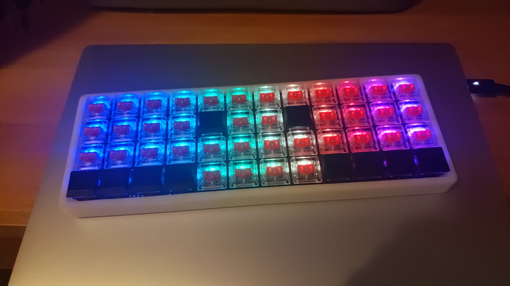
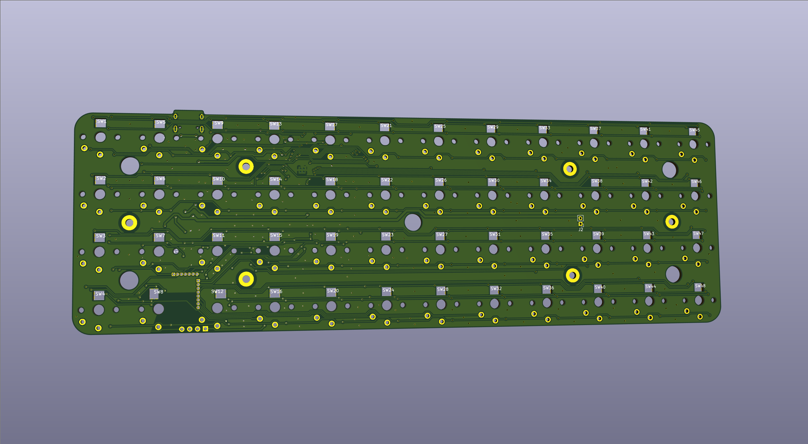

<style>
table {
border-collapse: collapse;
border-spacing: 0;
box-sizing: border-box;
}
table,th,td {
border: 1px solid grey;
line-height: 1.5;
}
td {
padding: 6px 13px;
}
</style>

&emsp;&emsp;几个月前我自己动手做了把类planck配列蓝牙键盘，命名方式延续了我的第一把自制键盘[QS75](https://github.com/chie4hao/qs75)，固件同样基于QMK。芯片基于nrf52840。由于QMK目前还没有引入nrf库，所以很多芯片底层外设的移植还需自己完成，相比之前基于stm32的QS75开发难度大了不少。整个固件开发时间约一个半月，加上后面画板和调试，总共花费近两个多月时间，目前固件代码已在github上开源[qmk-firmware-nrf52840](https://github.com/chie4hao/qmk_firmware_nrf52840)，基本上对QMK所有常用功能都做了兼容，配置和刷机方法和QMK一致，欢迎star、fork。



&emsp;&emsp;外壳方面为了省事使用了OLKB开源的项目[hi-pro-bottom](https://github.com/olkb/olkb_parts/blob/master/planck/hi-pro-bottom.stl)由于这个壳只适配普通轴体所以换成矮轴后会有些偏厚，后续有时间的话会考虑学下blender重画一版外壳改善一下厚度。pcb这块就没什么说的了，为了能正好能放下蓝牙模块，使用最近比较流行的凯华矮轴，设计也很简单，仅有一个充电led和复位按钮，充电led指示充电模块是否正常工作，复位按钮主要为防止固件bug出现程序跑飞的情况，总的来说这块板子还不算很成熟再加上本人画板水平比较low所以就不放地址了，有需要的自寻。键盘功能比较多，下面简要列几点并介绍下如何使用固件。

## 主要特点

* 更流行的type-c接口
* 全轴RGB，灯效和配置兼容QMK
* usb和蓝牙模式自动切换，插拔usb线和开机或复位时自动检测并进入对应模式。
* usb和蓝牙下都支持全键无冲、鼠标控制、多媒体键。支持midi控制，配置方法和qmk一致
<font size="1">（部分功能需要较新版本系统才支持）</font>
* 支持电量显示
* 快速响应，默认4ms矩阵扫描间隔，使用eager_pr消抖算法
* 低功耗。实测关闭RGB情况，默认功率下睡眠功耗13uA；正常使用功耗1.2mA左右(开启DC/DC后在不降低性能的前提下可控制在650uA左右，最近一次提交已默认开启DC/DC)。
* 长时间不使用自动进入睡眠模式，按任意键即可唤醒。也可手动进入睡眠模式，此时只有插入usb线或者按pcb背面复位开关才可唤醒，方便外出携带。
* 蓝牙模式下支持最多八个设备随意切换
* 下载bootloader后一根usb线即可刷机，不需额外仿真器
* Fully open-source

&emsp;
***
## 固件升级方法


### 搭建编译和刷机所需环境

&emsp;&emsp;首先clone下源代码，nRF5 SDK已作为子模块集成在项目中，不需额外安装。
``` bash
git clone --recurse-submodules https://github.com/chie4hao/qmk_firmware_nrf52840.git
cd qmk_firmware
```

&emsp;&emsp;参考QMK文档配置好编译固件所需环境([set-up-your-environment](https://docs.qmk.fm/#/newbs_getting_started?id=set-up-your-environment))，**（主要是安装arm交叉编译工具链，如果之前没玩过QMK请反复阅读此文档，大部分问题都可以在这里解决）**。此外还要额外安装NORDIC官方提供的固件更新工具[nrfutil](https://github.com/NordicSemiconductor/pc-nrfutil)，安装`Python`和包管理工具`pip`后输入`pip install nrfutil`即可。

### 通过jlink下载bootloader
&emsp;&emsp;一般新买的蓝牙模块内是不带bootloader的，需使用jlink手动下载bootloader，安装[jlink](https://www.segger.com/products/debug-probes/j-link/models/j-link-base/)驱动和[nRF-Command-Line-Tools](https://www.nordicsemi.com/Software-and-tools/Development-Tools/nRF-Command-Line-Tools)后，使用jlink通过SWD连接到蓝牙模块<font size="1">（只需连接`VRef` `GND` `SWDIO` `SWCLK`四根线）</font>。这里提供了自动构建bootloader的脚本，以QS40为例，一行命令即可编译bootloader并将softdevice和bootloader同时下载到模块中。<font size="1">（如果模块自带bootloader可略过此步）</font>
``` bash
make qs40:default:bootloader
```

### 刷机
&emsp;&emsp;方法和QMK刷机方法大同小异，以QS40为例，首先连接usb数据线，输入如下命令随后按下键盘上的`RESET`键进入bootloader模式即可完成编译和刷机操作。
``` bash
make qs40:default:nrfutil
```
&emsp;&emsp;为保证定时器精准，固件默认使用的外部32768晶振。所以如果刷机后没有搜索到蓝牙广播多半是因为没有接外部晶振或者没有起振。

&emsp;
***
## 其他说明
&emsp;&emsp;主要是对新增的按键和配置选项进行说明。[keymap.c](https://github.com/chie4hao/qmk_firmware_nrf52840/blob/master/keyboards/qs40/keymaps/default/keymap.c)增加的几个常用按键：

| 键名 | 功能 |
| :------: | :------: |
| RESET | 进入bootloader模式 |
| REBOOT | 软重启 |
| OUT_USB | 切换到有线模式 |
| OUT_BT | 切换到蓝牙无线模式 |
| DISC | 断开蓝牙连接，广播状态下关闭广播 |
| ADVW | 无白名单模式下广播 |
| ADVS | 开启蓝牙广播 |
| SEL1 | 蓝牙模式下切换到已配对的蓝牙设备1，以此类推 |
| DELB | 删除所有蓝牙配对信息 |
| SLEEP | 手动进入睡眠模式，插入usb线或者轻触pcb背面复位开关唤醒 |

&emsp;
<div></div>
&emsp;

[config.h](https://github.com/chie4hao/qmk_firmware_nrf52840/blob/master/keyboards/qs40/keymaps/default/config.h)中增加的宏：

| 宏名 | 描述 |
| :------: | :------: |
| KEYBOARD\_SCAN\_INTERVAL | 矩阵扫描间隔，默认3ms |
| POWER\_SAVE\_TIMEOUT | 进入睡眠模式时间
| KBD\_WDT\_ENABLE | 是否开启看门狗，默认关闭 |
&emsp;
***
## End
&emsp;&emsp;不知不觉入客制键盘坑半年多了，做完第一把客制键盘QS75后本来想继续完成我之前的全模拟输入键盘的想法，不过因为Wooting的那个磁轴还没量产就拖了一段时间，后面也是因为跟风才做了这把蓝牙键盘~~（做完发现蓝牙还挺好用的~~。这篇blog本来之前就应该完成了，可惜因为次意外卧床很久就耽搁了，今天总算把这个坑填上，感谢圈内大佬一路对我的支持和帮助，即使退坑了这个项目今后还会继续维护，有什么意见或者遇到问题欢迎留言，会尽快回复的。
